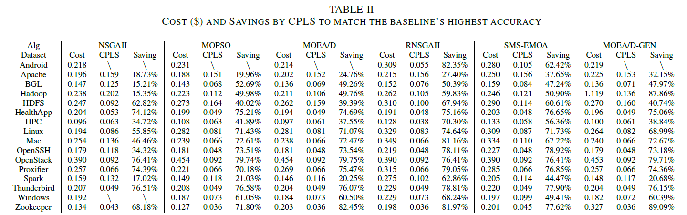
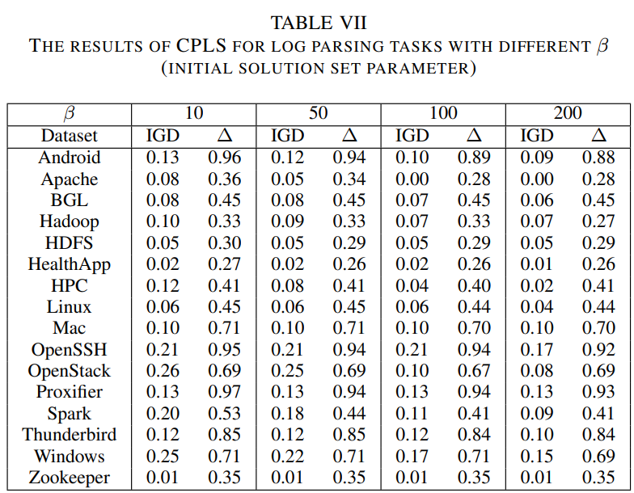

# CPLS
This is the repository for the paper: 

CPLS: Optimizing the Assignment of LLM Queries

Abstract: 
Large Language Models (LLMs) like ChatGPT have gained significant attention because of their impressive capabilities, leading to a dramatic increase in their integration into intelligent software engineering. However, their usage as a service with varying performance and price options presents a challenging trade-off between desired performance and the associated cost. To address this challenge, we propose CPLS, a framework that utilizes transfer learning and local search techniques for assigning intelligent software engineering jobs to LLM-based services. CPLS aims to minimize the total cost of LLM invocations while maximizing the overall accuracy. The framework first leverages knowledge from historical data across different projects to predict the probability of an LLM processing a query correctly. Then, CPLS incorporates problem-specific rules into a local search algorithm to effectively generate Pareto optimal solutions based on the predicted accuracy and cost. 

## 1. Framework
CPLS consists of two main components: cross-project prediction and local-search based optimization. The prediction component utilizes knowledge from historical data across different projects to estimate the probability of an LLM correctly processing a query. With the cost and predicted accuracy, the optimization component selects the most suitable LLM for each query through problem-specific rules.

 An overview of OptLLM

## 2. Benchmarks
To evaluate the proposed approach, we conduct extensive experiments on LLM-based log parsing, a typical software maintenance task. 

We leverage log data originated from the LogPai benchmark as a study case. LogPai is a comprehensive collection of log data originating from 16 diverse systems

## 3. Baselines and Parameter Setting
### 3.1 Baselines
OptLLM utilizes a heuristic search-based algorithm in optimization. We compare the effectiveness of this algorithm with well-known multi-objective optimization algorithms, including the Non-dominated Sorting Genetic Algorithm (NSGA-\rom{2})^[8], Multi-objective Particle Swarm Optimisation (MOPSO)^[9], and Multi-objective Evolutionary Algorithm with Decomposition (MOEA/D)^[10]. These three algorithms have been extensively studied and have proven to be effective in solving a wide range of multi-objective optimization problems. In addition, three variants of classic algorithms are also compared, including R-NSGA-\rom{2}^[11], SMS-EMOA^[12], and MOEA/D-GEN^[13]. It is important to note that all the evaluated multi-objective optimization algorithms are integrated with the same prediction component as OptLLM, to enable a fair comparison of the optimization strategies. 
### 3.2 Parameter Setting
Optuna is a widely used hyperparameter optimization package. To ensure the effectiveness and efficiency of all algorithms, we conduct parameter tuning using Optuna to choose optimal parameter settings. Based on the experiments, the parameters of algorithms are set as follows:

| Algorithm  | Parameter Settings                                                                                                                  |
|------------|-------------------------------------------------------------------------------------------------------------------------------------|
| CPLS       | initial_solution_size: 87, sampling_sum: 29                                                                                         |
| NSGA-II    | crossover_prob: 0.7780, crossover_eta: 7, mutation_prob: 0.8119, mutation_eta: 9, sampling: 'LHS', selection: 'TournamentSelection' |
| R-NSGA-II  | epsilon: 0.9964                                                                                                                     |
| SMS-EMOA   | crossover_prob: 0.7595, crossover_eta: 5, mutation_prob: 0.0675, mutation_eta: 28, sampling: 'FloatRandomSampling'                  |
| MOEA/D     | weight_generation: 'grid', decomposition: 'bi', neighbours: 10                                                                      |
| MOEA/D-GEN | weight_generation: 'random', decomposition: 'tchebycheff', neighbours: 24                                                           |
| MOPSO      | omega: 0.7887, c1: 0.7497, c2: 0.1537, v_coeff: 0.9518                                                                              |

The record of the tunning process is available under `OptLLM/parameter_setting/res` directory.
## 4 Results
### 4.1 Metrics 
#### 4.1 Evaluating solution performance
When assessing the performance of a single solution, such as submitting all jobs to an individual LLM, a direct comparison of the optimization objectives is feasible. 
- $f_{cost}$: total cost of invoking LLM APIs
- $f_{acc}$: the percentage of jobs processed accurately
#### 4.2 Multi-objective optimization evaluation metrics
- Inverted Generational Distance (IGD): The IGD metric is used to measure the distance between the obtained solution set and the Pareto front (reference point set). A lower value of IGD represents a better performance.

- $\Delta$ metric: The $\Delta$ metric assesses the diversity and distribution of solutions across the Pareto front by measuring Euclidean distances between solutions and two extreme solutions.

- Computation time: The time for obtaining the solution set, calculated by minute.

### 4.2 Resutls and Analysis
To verify the comparison, we conduct a statistical test to evaluate the performance of OptLLM and the baselines. We use the following statistical tests:

Friedman Test: The Friedman test is a non-parametric statistical test that ranks the algorithms for each dataset separately. It tests the null hypothesis that all algorithms perform equally well. If the null hypothesis is rejected, it means that there are significant differences among the algorithms' performances.

Nemenyi Test: The Nemenyi test is a post-hoc test that is performed after the Friedman test if the null hypothesis is rejected. It is used to determine which specific pairs of algorithms have significant differences in their performance.
####
#### Comparison with the Baselines

 

 

 

#### Ablation Study

 

 

 

#### Effect of Hyper-Parameter Settings

 

 

## 5. Requirements
All the code is available under `CPLS` directory.
### 5.1 Library
1. Python 3.11
2. Pymoo
3. tiktoken

4. ...

To install all libraries:
$ pip install -r requirements.txt

### 5.2 How to run CPLS
$ python exp.py $

### 5.3 Source code
All source code is available under `OptLLM/igs` directory.

We used the standard version of NSGA-II, R-NSGA-II and SMS-EMOA implemented in the Pymoo library^[14], and MOPSO and MOEA/D in the Pygmo. 
The source code of the baselines is available under `OptLLM/baselines` directory.

| script       | Description                                                               |
| ------------ |---------------------------------------------------------------------------|
| `nsga2.py`   | Non-dominated Sorting Genetic Algorithm (NSGA-II)                         |
| `rnsga2.py`  | Reference point based Non-dominated Sorting Genetic Algorithm (R-NSGA-II) |
| `smsemoa.py` | SMS-EMOA                                                                  |
| `moead.py`   | Multi-objective EA with Decomposition (MOEA/D)                            |
| `moeadgen.py`| MOEA/D-GEN                                                                |
| `mopso.py`   | Multi-objective Particle Swarm Optimization (MOPSO)                       |
